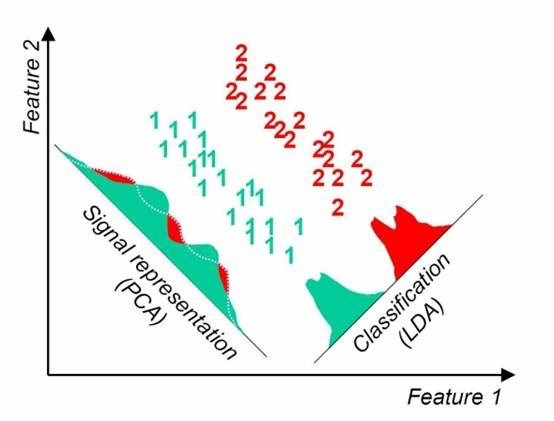

# Linear/Fisher Discriminant Analysis
他们说：**类内小，类间大**； **松耦合，高内聚**。

我说：**Mean，不同，不相为谋**

(Source: https://stackoverflow.com/questions/33576963/dimensions-reduction-in-matlab-using-pca)

Both PCA and LDA are linear transformation techniques used for dimensional reduction. PCA is an unsupervised learning algorithm but LDA is a supervised algorithm that decreases dimensions while maintaining the class-discriminatory information.

**LDA is also a linear classification algorithm.**

As shown in the figure, our target is to find a vector $u$ so that samples in same class are more close and those in different classes are as far as possible. As the result, they are more likely to be separated when they're mapping to this $u$.

## 1. Assumptions

Different group of data are separated by their means instead of variances, because LDA assume variance among all groups are equal.

The analysis is quite sensitive to outliers and the size of the smallest group must be larger than the number of predictor variables/features:

* **Multivariate normality:** Independent variables are _**normal**_ for each level of the grouping variable.

* **Homogeneity of variance/covariance (homoscedasticity):** Variances among group variables are the same across levels of predictors. 
    **Note:** If data can be separated by their means, this assumption sometimes can be violated.

* **Multicollinearity:** Predictive power can decrease with an increased correlation between predictor variables.

* **Independence:** Participants are assumed to be randomly sampled, and a participant's score on one variable is assumed to be independent of scores on that variable for all other participants.

It has been suggested that discriminant analysis is relatively robust to slight violations of these assumptions, and it has also been shown that discriminant analysis may still be reliable when using dichotomous variables (where multivariate normality is often violated).

## 2. PCA vs. LDA

| LDA                                                                                 | PCA                                              |
|-------------------------------------------------------------------------------------|--------------------------------------------------|
| Discovers relationship between Dependent & independent variables                    | Discovers relationship between independent variables |
| Used for variable reduction based on relationship between independent and dependent variables |         Used for reducing variables based on collinearity of independent variables                                         |
|           For classification                                                                          |                                                 |
|       Finds the direction that maximizes difference between two classes and minimizes difference within each class                                                                              |           Finds direction that maximizes the variance in the data                                      |
|           Supervised                                                                          |        Unsupervised                                         |

## 3. Binary Classification

Project raw data into lower dimensional space so that:
1. data in same group are as close as possible
2. data in different group are as far as possible.

 
Suppose the raw data are denoted as $X$, and the project on $w$ is:

$$\begin{align*}
Z_i&=w^T\cdot x_i = |w|\cdot |x_i| \cos \theta\ s.t.\ ||w||=1\\\\
\end{align*}
$$

The mean of projections is:
$$
\bar Z = \frac{1}{N}\sum_{i=1}^{N}Z_i = \frac{1}{N}\sum_{i=1}^{N}w^T\cdot x_i 
$$

The variance of projections is:

$$\begin{align*}
S_Z&=\frac{1}{N}\sum_{i=1}^{N}(Z_i-\bar Z)(Z_i-\bar Z)^T\\\\
&=\frac{1}{N}\sum_{i=1}^{N}(w^T\cdot x_i -\bar Z)(w^T\cdot x_i -\bar Z)^T
\end{align*}
$$

Now suppose we are dealing with a binary classification problem,  there are $N_1$ samples in group 1, and $N_2$ in group 2.

For class 1:
$$\begin{align*}
\bar {Z_1}&=\frac{1}{N_1}\sum_{i=1}^{N_1}Z_i=\frac{1}{N_1}\sum_{i=1}^{N_1}w^T\cdot x_i \\\\
S_1&=\frac{1}{N_1}\sum_{i=1}^{N_1}(w^T\cdot x_i -\bar {Z_1})(w^T\cdot X_i -\bar {Z_1})^T
\end{align*}
$$

For class 2:
$$\begin{align*}
\bar {Z_2}&=\frac{1}{N_2}\sum_{i=1}^{N_2}Z_i=\frac{1}{N_2}\sum_{i=1}^{N_2}w^T\cdot x_i \\\\
S_2&=\frac{1}{N_2}\sum_{i=1}^{N_2}(w^T\cdot x_i -\bar {Z_2})(w^T\cdot x_i -\bar {Z_2})^T
\end{align*}
$$

First, we want data in same group are as close as possible. 

$$
min:\ S_1+S_2
$$

Second, we want data in different groups are as far as possible.

$$
max:\ (\bar {Z_1} - \bar {Z_2})^2
$$

So the target function could be:

$$\begin{align*}
&max:\ J(w) = \frac{(\bar {Z_1} - \bar {Z_2})^2}{S_1+S_2}\\\\
\hat w &= \underset{w}{argmax} J(w)\\\\
\end{align*}
$$

then, using $S_1,\ \bar X_1$ to denote parameters of projections, and $S_{C1}, \bar X_{C1}$ to denote parameters of original data.

$$\begin{align*}
\bar {Z_1}&=\frac{1}{N_1}\sum_{i=1}^{N_1}Z_i=\frac{1}{N_1}\sum_{i=1}^{N_1}w^T\cdot x_i=w^T\bar{X}_{C1}\\\\
S_1 &= \frac{1}{N_1}\sum_{i=1}^{N_1}(w^T\cdot x_i -\bar {Z_1})(w^T\cdot x_i -\bar {Z_1})^T\\\\
&=w^T\frac{1}{N_1}\sum_{i=1}^{N_1}(x_i -\bar{X}_{C1})(x_i -\bar{X}_{C1})^Tw\\\\
&=w^TS_{C1}w
\\\\
J(w) &= \frac{(\bar {Z_1} - \bar {Z_2})^2}{S_1+S_2}\\\\
&=\frac{w^T\Big(\bar{X}_{C1}-\bar{X}_{C2}\Big)\Big(\bar{X}_{C1}-\bar{X}_{C2}\Big)^Tw}{w^TS_{C1}w+w^TS_{C2}w}\\\\
&=\frac{w^T\Big(\bar{X}_{C1}-\bar{X}_{C2}\Big)\Big(\bar{X} _{C1}-\bar{X}_{C2}\Big)^Tw}{w^T(S_{C1}+S_{C2})w}
\end{align*}
$$

Now, our target is:
$$
\begin{align*}
Max:\ J(w)&=\frac{w^T\Big(\bar{X}_{C1}-\bar{X}_{C2}\Big)\Big(\bar{X} _{C1}-\bar{X}_{C2}\Big)^Tw}{w^T(S_{C1}+S_{C2})w}\\\\
&=\frac{w^TS_bw}{w^TS_ww}\\\\
S_b&=\Big(\bar{X}_{C1}-\bar{X}_{C2}\Big)\Big(\bar{X} _{C1}-\bar{X}_{C2}\Big)^T\\\\
S_w&=S_{C1}+S_{C2}
\end{align*}
$$

where $S_b$ means the variance between classes, and $S_w$ means the variance within classes.

$$\begin{align*}
\frac{\partial J(w)}{\partial w} &= 2S_bw(w^TS_ww)^{-1}- (w^TS_bw)(w^TS_ww)^{-2}2S_ww=0\\\\
\Rightarrow\ &(w^TS_bw)S_ww=S_bw(w^TS_ww)\\\\
\Rightarrow\ &(w^TS_bw)S_ww=S_bw(w^TS_ww)\\\\
\end{align*}
$$

Since $w$ is $P\times 1$ and $S$ is $P\times P$, $w^TS_ww$ and $w^TS_bw$ are real numbers. 

We only care about direction of $w$. 

Then,

$$\begin{align*}
\Rightarrow\ &(w^TS_bw)S_ww=S_bw(w^TS_ww)\\\\
\Rightarrow\ &S_ww=\frac{(w^TS_ww)}{(w^TS_bw)}S_bw\\\\
\Rightarrow\ &w=\frac{(w^TS_ww)}{(w^TS_bw)}S_w^{-1}S_bw\\\\
\Rightarrow\ &w\propto S_w^{-1}S_bw\\\\
\Rightarrow\ &w\propto S_w^{-1}\Big(\bar{X}_{C1}-\bar{X}_{C2}\Big)\Big(\bar{X} _{C1}-\bar{X}_{C2}\Big)^Tw\\\\
\end{align*}
$$

$\Big(\bar{X} _{C1}-\bar{X}_{C2}\Big)^T$ is $1\times P$, so $\Big(\bar{X} _{C1}-\bar{X}_{C2}\Big)^Tw$ is a real number. 

Then,

$$\begin{align*}
\Rightarrow\ &w \propto S_w^{-1}\Big(\bar{X}_{C1}-\bar{X}_{C2}\Big)\Big(\bar{X}_{C1}-\bar{X}_{C2}\Big)^Tw\\\\
\Rightarrow\ &w \propto S_w^{-1}\Big(\bar{X}_{C1}-\bar{X}_{C2}\Big)
\end{align*}
$$

## 4. Limitation

* LDA produces at most 𝐶 − 1 feature projections.
* If feature size is much greater than sample size, data are way too sparse, then LDA will fail.
* LDA is a parametric method (it assumes unimodal Gaussian likelihoods).
* LDA will fail if discriminatory information is not in the mean but in the variance of the data.
* LDA is easily overfitting.

## References

1. https://en.wikipedia.org/wiki/Linear_discriminant_analysis#Assumptions
2. https://www.youtube.com/watch?v=M4HpyJHPYBY
3. http://research.cs.tamu.edu/prism/lectures/pr/pr_l10.pdf