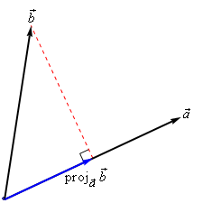
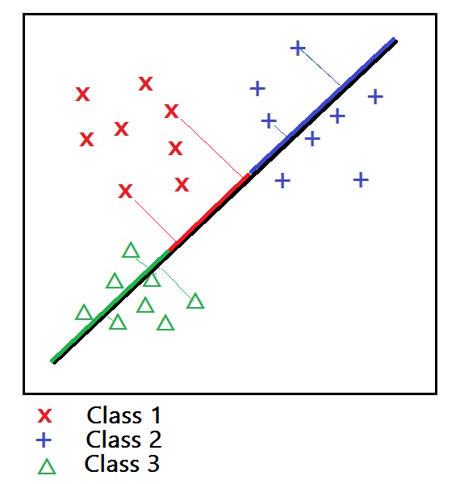

# PCA

Before reading this chapter, make sure finish reading [Dimensionality Reduction](https://github.com/uttgeorge/Machine-Learning-Models/blob/master/Dimensionality%20Reduction/Dimensionality%20Reduction.md)!

## 1. Key concept

Given a set of linear correlated variables, orthogonal transform them into a set of linear independent variables. In other words, find another set of orthogonal bases.

There are two perspectives:
1. Maximize variance of projection: **Keep most information**
2. Minimize reconstruction cost: **Minimize loss**

For more information about linear algebra, check:
* [16-Projection Matrices and Least Squares](https://github.com/uttgeorge/Linear-Algebra/blob/master/16-Projection%20Matrices%20and%20Least%20Squares.pdf)
* [17. Orthogonal Matrices, Gram-Schmidt](https://github.com/uttgeorge/Linear-Algebra/blob/master/17.%20Orthogonal%20Matrices%2C%20Gram-Schmidt.pdf)
* [21-Eigenvalue and Eigenvector](https://github.com/uttgeorge/Linear-Algebra/blob/master/21-Eigenvalue%20and%20Eigenvector.pdf)
* [22-Diagonalization and Power of A](https://github.com/uttgeorge/Linear-Algebra/blob/master/22-Diagonalization%20and%20Power%20of%20A.pdf)

## 2. Maximize the variance of projection

> #### 2.1 Zero-Centering
> 
> $X_i-\bar X = X^TH$
> 
> #### 2.2 Projection
> 
> The angle between a and b is $\theta$, the projection of vector b on vector a is:
> $$
> proj_ab=a\cdot b=|a||b|\cos\theta
> $$
> 
> Suppose the norm of b: $||a||=1$
> $$
> proj_ab=|b|\cos\theta
> $$ 
> 
> More general: 
> $$
> proj_ab=a_{1\times P}^Tb_{P\times 1}=Real\ Value
> $$ 
> 
> 
> (Source: https://tutorial.math.lamar.edu/classes/calcii/dotproduct.aspx)
> 
> #### 2.3 Maximize Variance (Projection)
> 
> Suppose $u_1$ is the best vector in 2-D space that maximize the projection of all points, and its norm is 1: $||u_1||=1$
> 
> After centering, the mean of data is 0, so the average variance of all projections is:
> 
> **Note:** The transpose of a real number is itself.
> 
> $$\begin{align*}
> J &= \frac{1}{N}\sum_{i=1}^{N}\big(\underset{Real\ Value}{\underbrace{(X_i-\bar X)^Tu_1-0}}\big)^2,\ s.t.\ u_1^Tu_1=1\\\\
> &=\frac{1}{N}\sum_{i=1}^{N}\big((X_i-\bar X)^Tu_1\big)^T\big((X_i-\bar X)^Tu_1\big)\\\\
> &=\frac{1}{N}\sum_{i=1}^{N}\big(u_1^T(X_i-\bar X)(X_i-\bar X)^Tu_1\big)\\\\
> &=u_1^T\big(\frac{1}{N}\sum_{i=1}^{N}(X_i-\bar X)(X_i-\bar X)^T\big)u_1\\\\
> &=u_1^TSu_1
> \end{align*}
> $$
> 
> Since, 
> $$\begin{align*}
> S_{P\times P} &=\frac{1}{N}\sum_{i=1}^{N}(X_i-\bar X)(X_i-\bar X)^T
> \end{align*}
> $$
> 
> Our target is to find a vector $u_1$ to maximize $J$:
> $$
> \hat{u_1}=\underset{u_1}{argmax}\ u_1^TSu_1,\ s.t.\ u_1^Tu_1=1
> $$ 
> 
> Lagrange Multiplier:
> $$\begin{align*}
> \mathcal{L} (u_1,\ \lambda)&=u_1^TSu_1+ \lambda(1 - u_1^Tu_1),\ s.t.\ \lambda>0\\\\
> \frac{\partial{\mathcal{L} }}{\partial{u_1}}&=2Su_1-2\lambda u_1=0\\\\
> Su_1&=\lambda u_1
> \end{align*}
> $$
> 
> $\lambda$ is the eigenvalue of $S$, and $u_1$ is the eigenvector of $S$
> 
> 
> 
> (Source: https://stackoverflow.com/questions/30977006/dimension-reduction-of-feature-in-machine-learning)
> 
> 

## 3. Minimize Reconstruction Cost
> #### 3.1  Cost
> 
> The reconstruction cost in 2-D is the distance from a point to the projection vector. Our target is to minimize the total "distance" of reconstruction.

## 4. SVD

SVD, check Linear Algebra [29-Singular Value Decomposition](https://github.com/uttgeorge/Linear-Algebra/blob/master/29-Singular%20Value%20Decomposition.pdf).

$$\begin{align*}
&(X_i-\bar X)^T  = HX=A=U\Sigma V^T\\\\
&1.\ U\ is\ a\ orthogonal\ matrix:\ U^TU=I\\\\\
&2.\ V\ is\ a\ orthogonal\ matrix:\ V^TV=I\\\\\
&3.\ \Sigma\ is\ a\ diagonal\ matrix\\\\\
\end{align*}
$$

Solve SVD for $A$:
$$\begin{align*}
S=\frac{1}{N}A^TA&=\frac{1}{N}X^TH^THX\\\\
&=\frac{1}{N}V\Sigma U^TU\Sigma V^T\\\\
&=\frac{1}{N}V\Sigma^2 V^T\\\\
T=\frac{1}{N}AA^T&=\frac{1}{N}HXX^TH^T\\\\&=\frac{1}{N}U\Sigma V^TV^T\Sigma U^T\\\\
&=\frac{1}{N}U\Sigma^2 U^T
\end{align*}
$$
$T$ and $S$ have the same eigenvalues $\Sigma^2$. 

$S$:
First $V$ is the new set of coordinates. Then for all data points, their new coordinate values are now $HX\cdot V$. 

$$HX\cdot V=U\Sigma V^TV=U\Sigma$$

$U\Sigma$ are the new coordinate values.

$T$:
It has another set of orthonormal eigenvectors $U$.

$$
T\cdot U\Sigma=\frac{1}{N}U\Sigma^2 U^TU\Sigma=(U\Sigma)\cdot \frac{1}{N}\Sigma^2
$$ 

Here $\frac{1}{N}\Sigma^2$ is the eigenvalue.

## 5. PCoA

## 6. PPCA

## Is Normalization Neccessary?

$
S_{P\times P}=\frac{1}{N}X^THX=\frac{1}{N}X^TH^THX=\frac{1}{N}(HX)^THX
$
