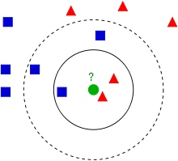

# KNN

-------

## Overview (近朱者赤，近墨者黑。)
K-nearest Neighbor algorithm (k-NN) is a non-parametric method used for classification and regression.

The KNN algorithm assumes that similar things exist in close proximity. In other words, similar things are near to each other. 

It only based one or several nearest neighbors to determine its category or value. And since it only rely on limited number of neighbors, KNN is more preferable when the data overlap a lot.


-------

## Basic Concept
We measure the distance from **query point** to each sample points, find the **K-nearest neighbors**, and determine the **label** or **value** of this query point.
### 1. Distance Metrics
We use **distance** to measure the similarity of different samples. Euclidean distance, Minkowski Distance, Mahalanobis Distance, Haversine Distance and Manhattan Distance are most commonly used.

* Euclidean distance
    * Euclidean distance
$$
\begin{align*}
& Distance\ from\ x_1\ to\ x_2:\\\\
& d(x_1,x_2) = \sqrt{\sum_{i=1}^{N}(x_{1i}-x_{2i})^2}
\end{align*}
$$
    But normally scales in different features are different, or in other words different scale in different dimension, we prefer to standardize the distance.
    
    * Standardized Euclidean Distance
$$
\begin{align*}
& Distance\ from\ x_1\ to\ x_2:\\\\
& x_{I}^{'} = \frac{x_i-\mu_i}{s_i}\\\\
& \mu: mean,\ s:standard\ variance\\\\
& d(x_1,x_2) = \sqrt{\sum_{i=1}^{N}(\frac{x_{1i}-x_{2i}}{s_i})^2}
\end{align*}
$$    
    
* Manhattan Distance

    $$
    \begin{align*}
    d(x_1,x_2) = \sum ( \left |x_{1i} - x_{2i} \right |)
    \end{align*}
    $$
    
* Minkowski Distance
    
    $$
    \begin{align*}
    & d(x_1,x_2) = \Big(\sum_{i=1}^{N} \left | x_{1i} - x_{2i}\right |^p\Big )^{(1/p)}
    \end{align*}
    $$
    
    * When p = 1, it is Manhattan Distance;
    * When p = 2, it is Euclidean Distance;
    * When p is infinite, it is Chebyshev Distance.
    
    **Pitfalls:**
    1. Scale matters, if scales in different dimensions are different, these distance can not be applied unless standardizing them.
    2. Distribution in each dimension might be different.
    3. We assume that features are independent to each other.
    
* Mahalanobis Distance

    Since the disadvantage of Euclidean distance, we introduce Mahalanobis Distance. This distance utilizes covariance matrix $\Sigma$ to offset the impact of different scales. 
    $$
    \begin{align*}
    & d(X,Y) = \sqrt{(X-Y)^T\Sigma^{-1}(X-Y)}
    \end{align*}
    $$   
    
* Haversine Distance

### 2. Choosing K
#### a. Impact of K

* Large K
If K is too large, then we will take those not similar points into consideration. The system bias will be low but the variance will be high. The system will be very robust.
* Small K
If K is too small, the result may easily be affected by noise. The bias will be high and variance will be low. The system will be very sensitive. 

#### b. How to choose the best K

* **Using Cross Validation**

* Empirical rule: K is normally less than the square root of number of sample size.

### 3. Decision Rule

* **Classification:**  The majority wins.
* **Regression:** Mean of K-nearest neighbors.


-------

## Algorithms


```python
import pandas as pd
import numpy as np
import matplotlib.pyplot as plt
import seaborn as sns
from collections import defaultdict
%matplotlib inline
```


```python
class KNNClassifier():
    """
    KNN Classifier.
    
    Parameters
    ------------------
    K: int
        K nearest neighbors. default 1 to m(Sample Size)
    distance: string
        distance metrics
    weight: (Not Using)
        
    Attributes
    ------------------
    
    
    """
    
    def __init__(self,algorithm = 'brute', distance = 'Euclidean',K=1,p=1):

        self.K = K
        
        self.algorithm = algorithm
        """
        3 algorithms
        """
        
        self.distance = distance
        
        # When using _Minkowski_Distance, p needs to be set
        self.p = p
        
        if self.distance == 'Euclidean':
            self.distance_metrics = self._Euclidean_Distance
        elif self.distance == 'Manhattan':
            self.distance_metrics = self._Manhattan_Distance
        elif self.distance == 'Minkowski':
            self.distance_metrics = self._Minkowski_Distance
        elif self.distance == 'Mahalanobis':
            self.distance_metrics = self._Mahalanobis_Distance
        elif self.distance == 'Haversine':
            self.distance_metrics = self._Haversine_Distance
    
    def _Euclidean_Distance(self, X, Dataset):
        m,n = Dataset.shape
        diff = np.tile(X,(m,1)) - Dataset
        sqDiff = diff**2
        sumSqDiff = sqDiff.sum(axis=1)
        dist = sumSqDiff ** 0.5
        return dist
    
    def _Manhattan_Distance(self, X, Dataset):
        m,n = Dataset.shape
        diff = np.tile(X,(m,1)) - Dataset
        absDiff = np.abs(diff)
        dist = absDiff.sum(axis=1)
        return dist
    
    def _Minkowski_Distance(self, X, Dataset):
        m,n = Dataset.shape
        diff = np.tile(X,(m,1)) - Dataset
        absDiff = np.abs(diff)
        sqAbsDiff = absDiff**self.p
        totalDiff = sqAbsDiff.sum(axis=1)
        dist = totalDiff**(1/self.p)
        return dist
    
    def _Mahalanobis_Distance(self, X, Dataset):
        pass
    
    def _Haversine_Distance(self, X, Dataset):
        pass
    
        
    def fit(self,X_train,y_train,verbose= True):
        """
        Fit method for training data.
        
        Parameters:
        -----------------------
        X_train: {array-like}, shape = [n_samples, n_features]
            Training matrix, where 'n_samples' is the number of samples 
            and 'n_features' is the number of features
        y_train: {array-like}, shape = [n_samples]
            Target labels
        
        Attributes:
        -----------------------
        d_record_: list
            Record all distance.
        error_rate_: list
            Record all missclassification rate.  
        
        Returns:
        ------------------------
        self: object
        
        """
        if self.algorithm == 'brute':
            self.Dataset = X_train
            self.Label = y_train
        
    def predict(self, X_test):
        
        m,n = X_test.shape
        prediction = []
        for i in range(m):
            
            Dist = self.distance_metrics(X_test[i,:],self.Dataset)
            SortedDistIndex = np.argsort(Dist)
            
            classCount = defaultdict(int)
            for j in range(self.K):
                lab = self.Label[SortedDistIndex[j]][0]
                classCount[lab] += 1
            sortedPredict = sorted(classCount.items(), key=lambda item: item[1])
            prediction.append(sortedPredict[0][0])
        
        return prediction
    
```


```python
from sklearn import datasets
iris = datasets.load_iris()

feature = pd.DataFrame(iris.data,columns=iris.feature_names)
target = pd.DataFrame(iris.target,columns=['target'])
df = pd.concat([feature,target],axis=1)
df = df[df['target']!=2]
df =df.reset_index()
target = df['target'].to_frame()
feature = df.drop('target',axis=1)
```


```python
X_train = feature.to_numpy()
#data_mat = np.asmatrix(feature)
y_train = target.to_numpy()
#label_mat = np.asmatrix(target)
```


```python
knn = KNNClassifier(distance = 'Minkowski', p = 1, K = 3)
```


```python
knn.fit(X_train,y_train)
```


```python
y_pred = knn.predict(X_train)
```


```python
from sklearn.metrics import confusion_matrix
```


```python
confusion_matrix(y_train,y_pred)
```


    array([[50,  0],
           [ 0, 50]])


